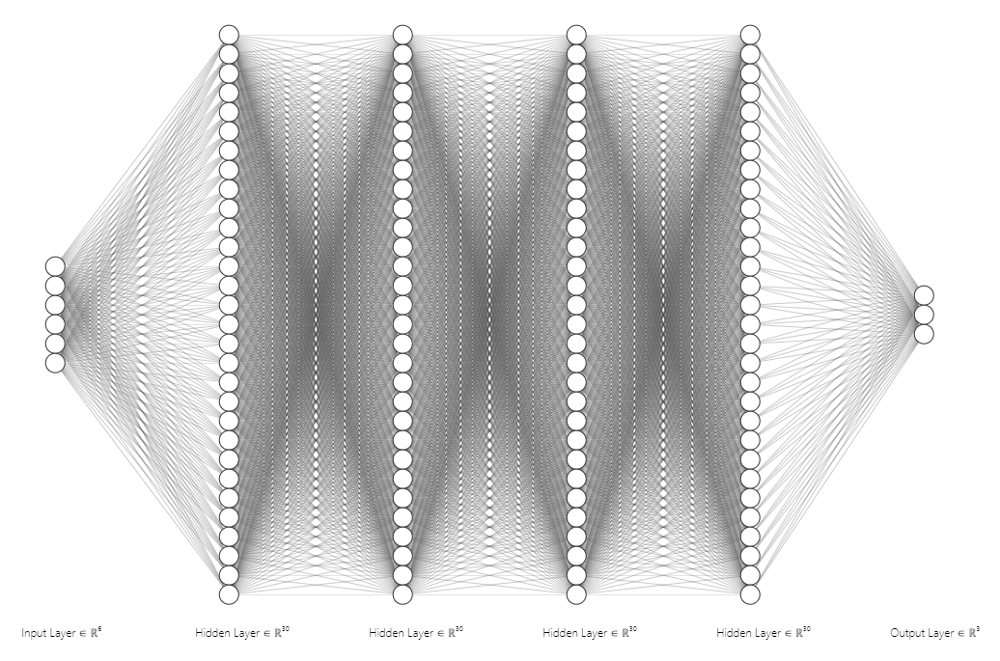

# COVID-19 spread prediction

## Outline:
* Introduction:
* Motivation:
* Dataset
* Feature extraction
* Model
* Results
* Running the code
* References

## Introduction:
Coronavirus disease 2019 (COVID-19) is an infectious disease caused by severe acute respiratory syndrome coronavirus 2 (SARS-CoV-2). The disease was first identified in December 2019 in Wuhan, the capital of China's Hubei province, and has since spread globally, resulting in the ongoing 2019–20 coronavirus pandemic. The first confirmed case of what was then an unknown coronavirus was traced back to November 2019 in Hubei.

## Motivation:
Predicting the number of new cases and deaths is very crucial in defeating the virus. Prediction number could help predict a large outbreak, which allows for better preparation in terms of medical equipment and staff, or lockdown if necessary.

## Dataset:
The dataset consists of the total number of cases and deaths for 265 places. Some countries are represented as multiple provenances. The number a listed per day starting from 22nd of January 2020 till the current date. The dataset also includes the latitudinal and longitudinal location. Another dataset was used to get statistical information about each country. They are as follows population, density, area, and urban percentage.

## Feature extraction:
The basic features for each country are population, density, area, and urban percentage. Moreover, we consider the number of new cases and deaths for past n-days (10 days) as input. It's hard to find a pattern when the number of current cases is zero or very small, so we only consider dates were the total number of cases is greater than m-cases (100 cases). Normalization was done for all features to ensure (0-1) range.

## Model:
A Recurrent Neural Network (RNN) model was used, as it's able to predict multiple days in the future. The network consists of four full connected layers, each with 200 neurons. Three Dropout layer was used with a drop rate of 0.1 and a RELU activation layer. Mean absolute loss function provided better results as opposed to mean square error as it gives higher weight to high error. Adam optimizer was used because it has a decaying learning rate.  Using the model to predict for the next n-days is done by predicting the first day values, the output is used to predict the next day. This is repeated n-times to predict for n-days.

## Results:
After training the model for 1000 epoch, it resulted in a mean absolute error MAE for the validation data is 0.07. So considering a normalization factor of 1000 for cases, and 100 for deaths means that the case error is 70 cases, and 7 for deaths.  The Mean Absolute Percentage Error is 32.37% for the test sample, samples with zero value are ignored.

## Running the code:
1. Copy the latest dataset from the github link
2. Run the preprocessing.py
3. Run the train_predict.py
4. The prediction will be in output folder

## References:
- https://www.kaggle.com/fernandol/countries-of-the-world
- https://github.com/CSSEGISandData/COVID-19

Note: This project is part of a Machine learning course taught by Dr.Davor Svetinovic
